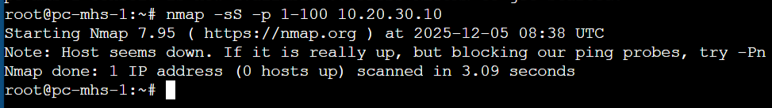
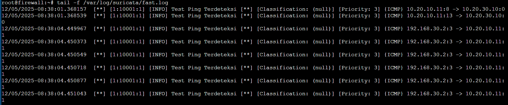
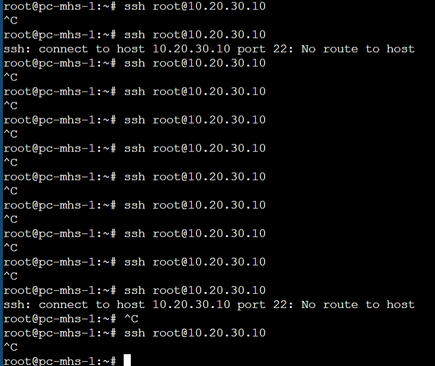
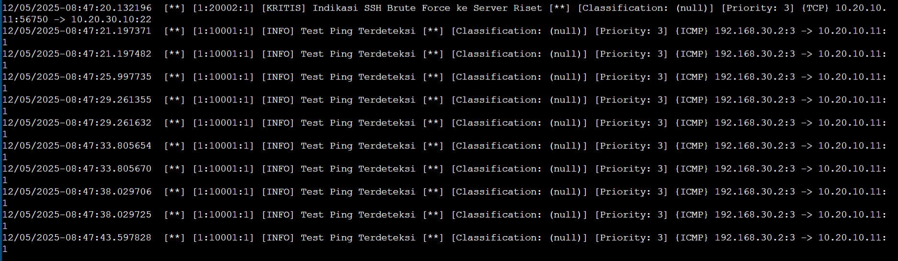
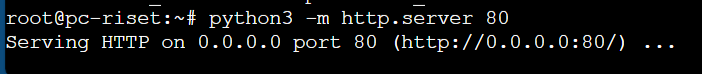
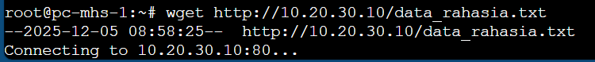
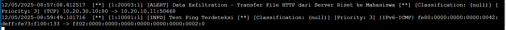

| Nama                       | Nrp        |
| -------------------------- | ---------- |
| Rizqi Akbar Sukirman Putra | 5027241044 |
| Oscaryavat Viryavan        | 5027241053 |
| Nisrina Bilqis             | 5027241054 |
| Ica Zika Hamizah           | 5027241058 |

## Topologi

## FILOSOFI DAN KEBIJAKAN KEAMANAN

1. Prinsip Dasar: Zero Trust Intranet
   Filosofi yang digunakan adalah "Zero Trust Intranet", yang berarti tidak ada subnet internal yang dipercaya secara otomatis. Kebijakan ini mewajibkan penerapan Prinsip Hak Akses Minimum (Least Privilege), di mana komunikasi antar-subnet secara default diblokir dan hanya diizinkan melalui aturan eksplisit (ALLOW) pada protokol dan port yang spesifik.

2. Desain Topologi Final
   Topologi ini mengadopsi arsitektur Firewall Terpusat dengan enam Zona Keamanan yang diisolasi secara fisik melalui interface yang berbeda pada perangkat firewall. Perangkat firewall bertindak sebagai Gateway L3, DHCP Server, dan Stateful Firewall utama.

## IDS Suricata

### Skenario 1

RECONNAISSANCE (Port Scanning)
Node Attacker: PC Mahasiswa
Node Target: PC Riset

PC Mahasiswa mencoba nmap ke PC Riset

Terdeteksi di suricata

### Skenario 2

EXPLOITATION (SSH Brute Force)
Node Attacker: PC Mahasiswa
Node Target: PC Riset

PC Mahasiswa mencoba Brute Force ke PC Riset

Terdeteksi di suricata

### Skenario 3

ACTIONS ON OBJECTIVE (Data Exfiltration)
Node Attacker: PC Mahasiswa (Pencuri)
Node Target: PC Riset (Korban yang menyimpan file)

PC Riset menjalankan web server python di port 80

PC Mahasiswa mencoba membaca data di PC Riset

Terdeteksi di suricata

