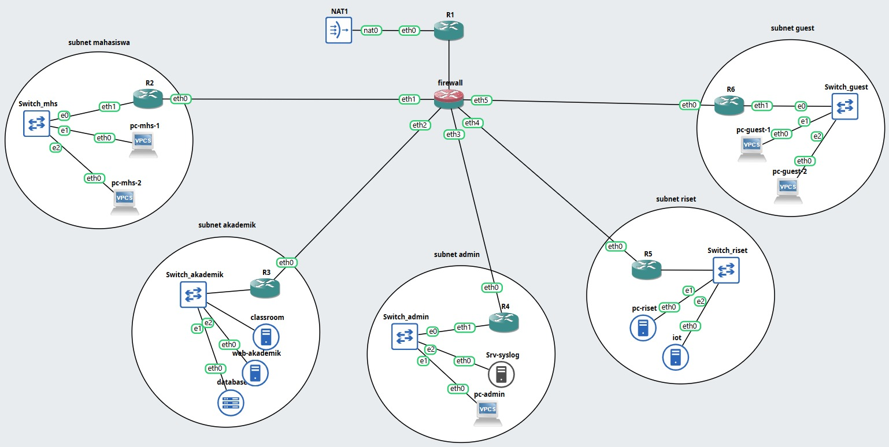

| Nama                         | Nrp        |
| ---------------------------- | ---------- |
| Rizqi Akbar Sukirman Putra          | 5027241044 |
| Oscaryavat Viryavan  | 5027241053 |
| Nisrina Bilqis          | 5027241054 |
| Ica Zika Hamizah  | 5027241058 |

## Topologi

## FILOSOFI DAN KEBIJAKAN KEAMANAN
1. Prinsip Dasar: Zero Trust Intranet
Filosofi yang digunakan adalah "Zero Trust Intranet", yang berarti tidak ada subnet internal yang dipercaya secara otomatis. Kebijakan ini mewajibkan penerapan Prinsip Hak Akses Minimum (Least Privilege), di mana komunikasi antar-subnet secara default diblokir dan hanya diizinkan melalui aturan eksplisit (ALLOW) pada protokol dan port yang spesifik.

2. Desain Topologi Final
Topologi ini mengadopsi arsitektur Firewall Terpusat dengan enam Zona Keamanan yang diisolasi secara fisik melalui interface yang berbeda pada perangkat firewall. Perangkat firewall bertindak sebagai Gateway L3, DHCP Server, dan Stateful Firewall utama.